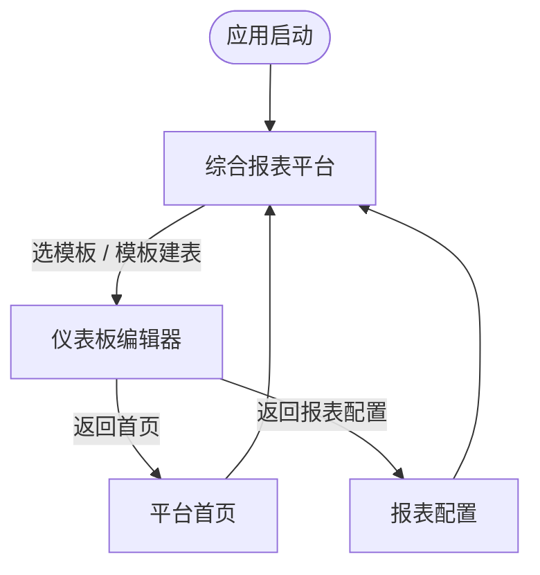
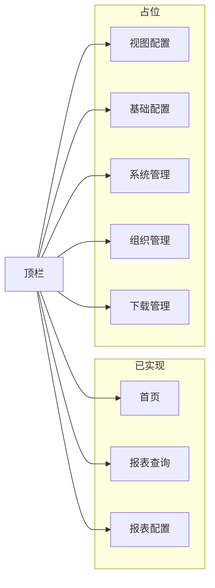
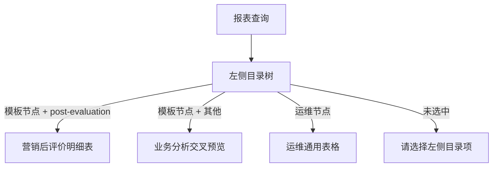
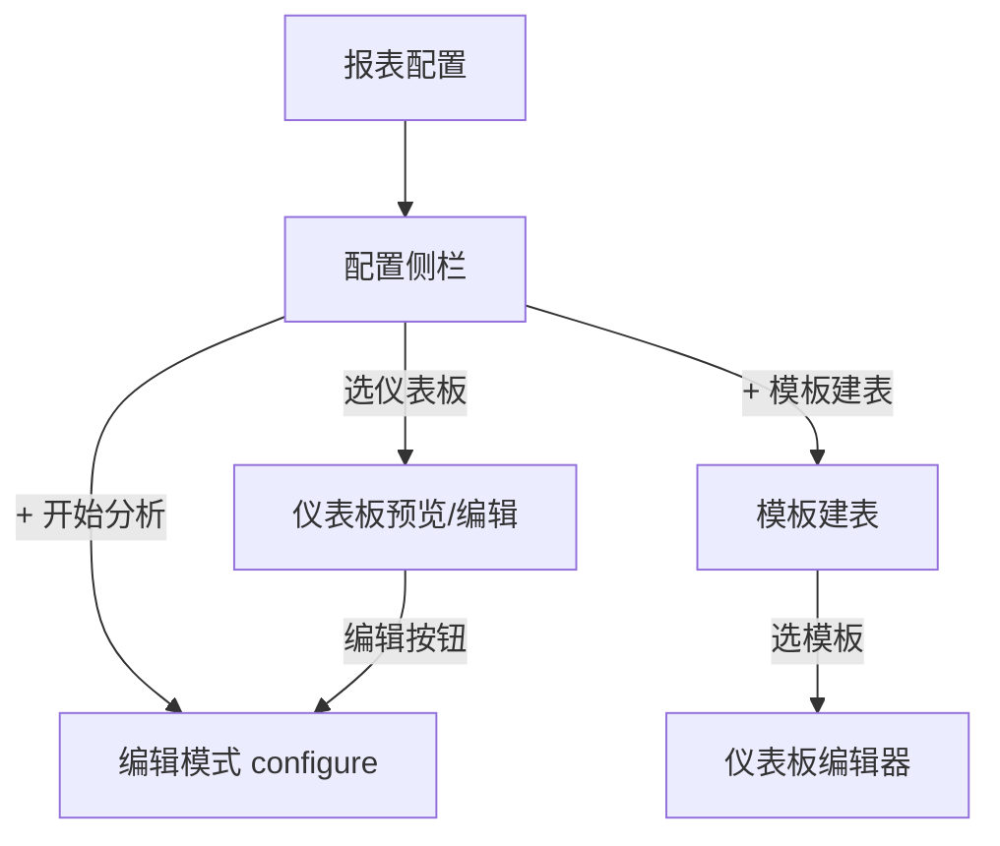

# 页面关系图

> 生成：2026-05-25

## 应用级导航

## 综合报表平台 — 顶栏

## 报表查询 — 内容路由

## 报表配置 — 内容路由

## 页面跳转参数

| 从 | 到 | 传递参数 |
|----|-----|----------|
| 首页 | 编辑器 | templateIdx, returnNav=home |
| 模板建表 | 编辑器 | templateIdx, returnNav=reportConfig |
| 编辑器 | 平台 | 恢复 integratedInitialNav |
| 报表查询树 | 查询内容 | querySelectedId → 树节点 metadata |

## 数据耦合

| 共享数据 | 使用页面 |
|----------|----------|
| TEMPLATES / MARKET_TEMPLATE_IDS | 首页、模板建表、编辑器、查询/配置树 |
| SelfServiceQueryBoardCard | 查询业务分析、配置仪表板、编辑器全画布 |
| REPORT_QUERY_TREE | 报表查询侧栏 |
| REPORT_CONFIG_TREE | 报表配置侧栏 |

## 默认 landing

| 场景 | 默认值 |
|------|--------|
| 应用启动 view | integratedReport |
| 初始 topNav | home（可受 integratedInitialNav 影响） |
| 查询树选中 | report-post-evaluation-main |
| 配置树选中 | dashboard-report-kpi |
